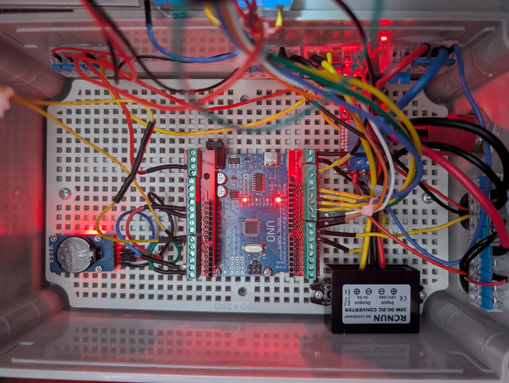

# Intelligent Visitor Counter and Occupancy Monitoring System

## 1) Overview

This project presents the design and development of an intelligent bidirectional visitor counting and occupancy monitoring system capable of accurately detecting people entering and leaving a controlled area in real time. The system combines embedded electronics, sensor integration, real-time processing, and visual feedback to provide a complete occupancy monitoring solution. The system continuously tracks visitor movements, calculates the current occupancy, and presents the information through an LCD interface and intelligent lighting indicators. The project was developed to demonstrate practical skills in
<strong>embedded systems</strong>,
<strong>electronics integration</strong>,
<strong>signal processing</strong>,
<strong>testing</strong>, and
<strong>validation</strong>.

The system provides:

- [x] Entry detection  
- [x] Exit detection  
- [x] Real-time occupancy monitoring  
- [x] LCD occupancy display  
- [x] RTC time display  
- [x] WS2812B occupancy visualization  
- [x] Capacity waring indication  

## 2) System Architecture

### 2.1 Main Components

| Component                   | Function                    |
| --------------------------- | --------------------------- |
| Arduino UNO                 | Main controller             |
| Sharp GP2Y0A21YK0F S1       | Entry detection             |
| Sharp GP2Y0A21YK0F S2       | Exit detection              |
| LCD 16x2                    | Visitor display             |
| DS3231 RTC                  | Time display                |
| WS2812B LED Strip           | Visual occupancy indication |
| BJ-1K buzzer                | Capacity warning            |
| 5V-12V single chanel relay  | ON/OFF buzzer               |

### 2.2 System architecture block diagram

<table>
  <tr>
    <td align="center">
       
  </tr>
</table>

**Figure 1.** Overall figure caption.

<table>
  <tr>
    <td align="center">
       
      (a) Wiring
    </td>
    <td align="center">
       
      (b) Sensors and LCD
    </td>
  </tr>
</table>

**Figure 1.** Overall figure caption.

## 3) Detection principles

### 3.1 Entrance trigger

| S1                 | S2                 | Count |
| ---                | ---                | ---   |
| :white_check_mark: | :x:                | 0     |
| :white_check_mark: | :white_check_mark: | 0     |
| :x:                | :white_check_mark: | 0     |
| :x:                | :x:                | +1    |

### 3.2 Exit trigger

| S1                 | S2                 | Count |
| ---                | ---                | ---   |
| :x:                | :white_check_mark: | 0     |
| :white_check_mark: | :white_check_mark: | 0     |
| :white_check_mark: | :x:                | 0     |
| :x:                | :x:                | -1    |

### 3.3 Reversal detection

A key strength of this counter is its ability to detect reversals. If a visitor changes direction while entering or exiting—whether before or after passing the sensors—the system recognizes the action and prevents an incorrect count.
